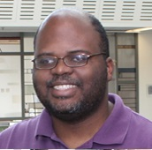

   
  
  # Full-Stack, GPU-based Acceleration of Deep Learning
  

A tutorial at CVPR2023, Vancouver, June 19th from 13:30 to 17:00

## Webpage
 [Visit our webpage](https://nvlabs.github.io/EfficientDL/)
 

## Description
This tutorial focuses on describing techniques to allow deep learning practitioners to accelerate the training and inference of large deep networks while also reducing memory requirements across a spectrum of off-the-shelf hardware for important applications such as autonomous driving and large language models. Topics include, but are not limited to:

- Deep learning specialized hardware overview. We review the architecture of the most used deep learning acceleration hardware, including the main computational processors and memory modules.</li>
- How deep learning is performed on this hardware. We cover aspects of algorithmic intensity and an overview of theoretical aspects of computing. Attendees will learn how to estimate processing time and latency by looking only at hardware specs and the network architecture.</li>
- Best practices for acceleration. We provide an overview of best practices for designing efficient neural networks including channel number selection, compute heavy operations, or reduction operations among others.</li>
- Existing tools for model acceleration. In this part we will focus on existing tools to accelerate a trained neural network on GPU devices. We will particularly discuss operation folding, TensorRT, ONNX graph optimization, sparsity.</li>
- Research overview of recent techniques. In the last part, we will focus on recent advanced techniques for post training model optimization including pruning, quantization, model distillation or NAS among others.</li>

## Program

<table>
  <tr>
    <td>13:30</td><td>13:35</td><td>Opening Remarks</td>
    </tr><tr>
    <td>13:35</td><td>14:15</td><td>Jason Clemons</td><td>foundations of GPU architecture, hardware perspective.</td>
    </tr>
    <tr>
    <td>14:15</td><td>15:00</td><td>Pavlo Molchanov</td><td>Algorithmic views on GPU compute, how to maximize performance</td>
    </tr>
    <tr>
    <td>15:00</td><td>15:30</td><td>Coffee Break</td><td></td>
    </tr><tr>
     <td>15:30</td><td>16:15</td><td>MAying Shen</td><td>Sparsity in DNN and model compression</td>
  </tr>
     <tr>
     <td>16:15</td><td>17:00</td><td>Hongxu (Danny) Yin</td><td>Recent trends on transformer acceleration, data efficiency and security,</td>
  </tr>
</table>

## Instructors

## Organizers
<ul> 
<li>Maying Shen, Senior Research Engineer
<li>Jason Clemons, Senior Research Scientist
<li>Hongxu (Danny) Yin, Senior Research Scientist
<li>Pavlo Molchanov, Principal Research Scientist
<li>Jose M. Alvarez, Director, Applied research 
<li>Jan Kautz, VP of research
</ul> 